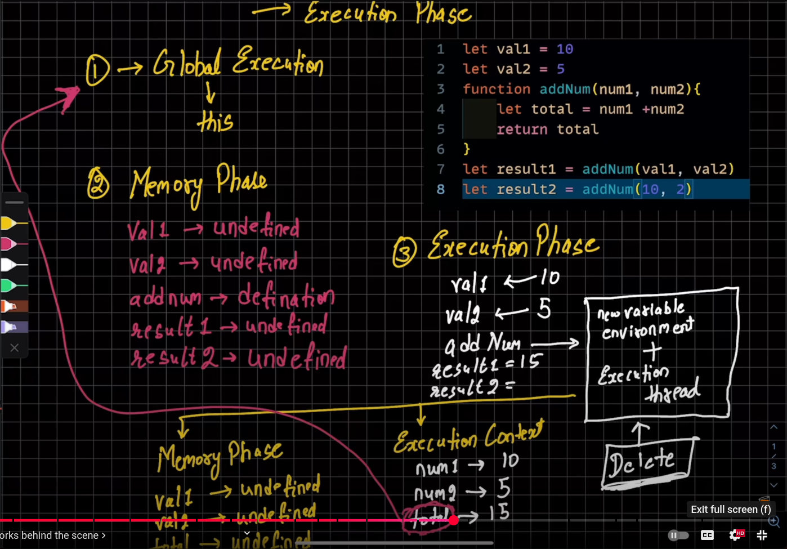
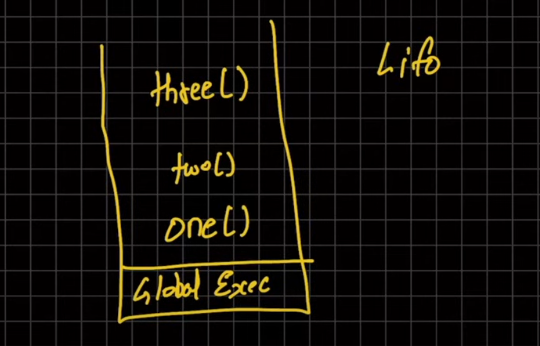

Javascript Execution Context
1.when we pass out code files to JS a Global Execution context is made and is refered to 'this' variable.
if we ran it in a browser, the Global EC is different in browser than node, bun etc.
generally for browser the value of 'this' is window object
This is executed in a thread
JS is a single threaded, everything is a process.

2. Function Execution Context
3. Eval Execution Context (when you read mongoose documentation)

4. The code runs in two phases:
    a. Memory creation phase (creation phase) : here memory is allocated to all the variables, or anything that we declared. No execution happens, any funtion, mathamatical fn +- are not executed.

5. code execution example:

{
    Let val1 = 10
    let val2 = 5
    Function addNum(num1, num2){
        let total = num1 + num2
        return total
    }
    let result1 = addNum( val1 , val2 )
    let result2 = addNum(10 ,2)
}

a. so any code executes with global execution funtion, and it is allocated to this variable at the start 
b. In memory phase all var are collected 
    
    (1st cycle)

    val1 -> Undefined
    val2 -> Undefined
    addNum -> defination i.e., (num1, num2){
        let total = num1 + num2
        return total}

    result1 ->Undefined
    result2 ->Undefined

    (2nd cycle) Execution phase

    val1 -> 10
    val2 -> 5
            nothing will happen to addNum as notthing to execute threaded
            as we already did defination, so no work in execution phase

            now for result1, addNum is required so
            (k*) addNum-> (a new execution context gets created (happens for every function))
                    it again, a new variable environment+ execution thread is formed  (a new sandbox is created here)
                    so again we start with

                    a. Memory phase 
                        val1 -> Undefined
                        val2 -> Undefined
                        total-> Undefined
                    
                    b. Execution context
                        num1  -> 10
                        num2  -> 5
                        total -> 15
            now the funtion also has a return, so it will return to its parent executional context 

//total returns to global execution context
            //the (k*) execution context will also get deleted after the work is done i.e. now  

    result1-> 15

            line 8.
            same for result2 now, same box with new variable env. + thread
            
            1. memory phase
                 val1 -> Undefined
                 val2 -> Undefined
                 total-> Undefined
            2. exection phase
                 num1  -> 10
                 num2  -> 2
                 total -> 12
    
    result2-> 12

call stack:

[for Truthy](../04_control_flow/truthy.js) 