- HTML is not an array by default it is a collection, it can be converted to one. So properties like map,forEach are not available.
- Although as it is like an array we can access some properties like array 
ex console.log(document.links(2)), and can manipulate a lot of things.
---------------------------------------------------------------------------------
Document Object Model

>[!Diagram](../assets/DOM.png)
---------------------------------------------------------------------------------
Manipulating html tags
> using tool to find id
[!Diagram](../assets/1.png)

> using id tag to find and replace innerHTML working
[!Diagram](../assets/2.png)

------------------------------------------------------------
HTML
- use document.getElementById("title")
 output provides <h1 id="title" class="heading">Dom learning JS </h1>

 then we can get other elements using .
 document.getElementById("title").id
 'title'

 document.getElementById("title").getAttribute("class")
 "heading"

similarly we can use set

 document.getElementById("title").setAttribute("class", "test") # this will always override the previous attribute 

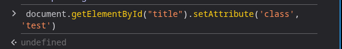

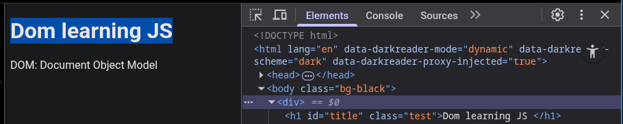

can also do both

 document.getElementById("title").setAttribute("class", "test , heading")

 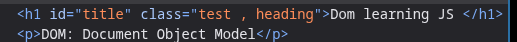

some oother changes: 
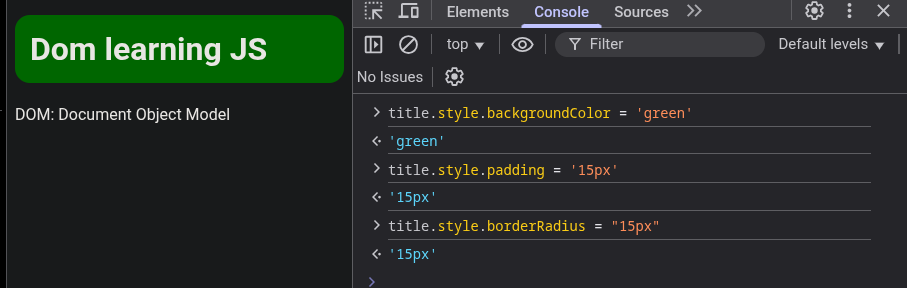

difference between innerText and textContent 
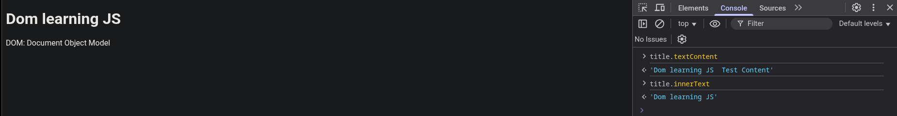

innerHTML gives all the html if present
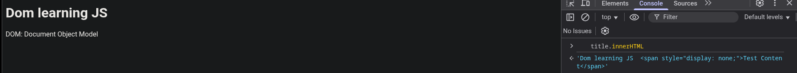

document.querySelector("h2") # gives the first query
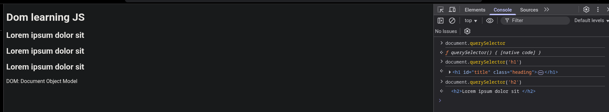

can also use css selectors like # and , # used for id and . for class
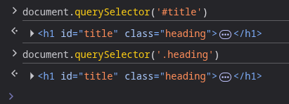

also use input and other css selectors here example
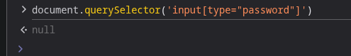

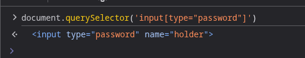

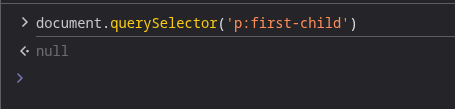   

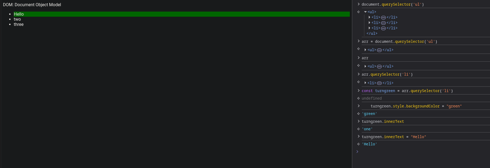

When using querySelectorAll we dont get pure array as there is no map option 
example: 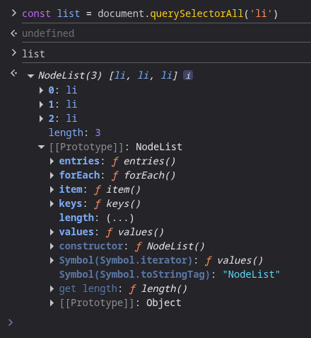

example of pure array 
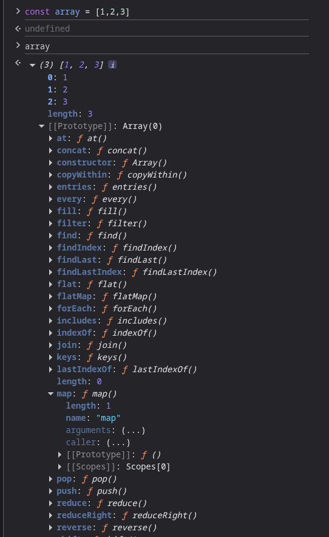

node list
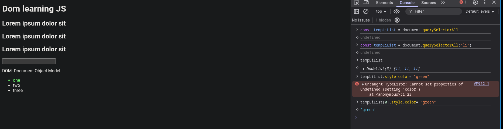

even if there is just one element we need to specify it so as to specify
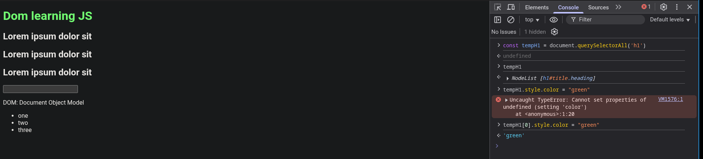

using forEach properties
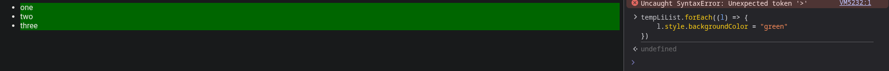

in case of htmlCollectiona and node list we need to convert it to array to use looping and stuff as it doesnt provide one 
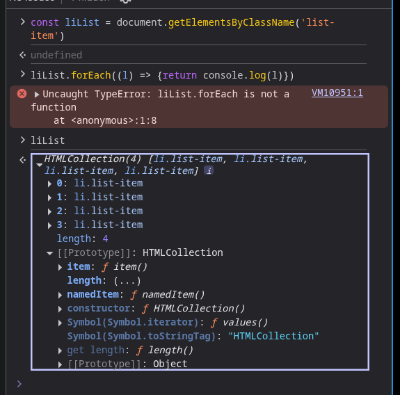

converted to array from html Collection
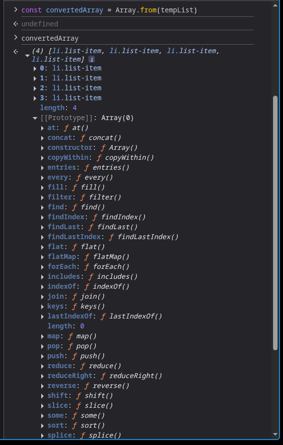

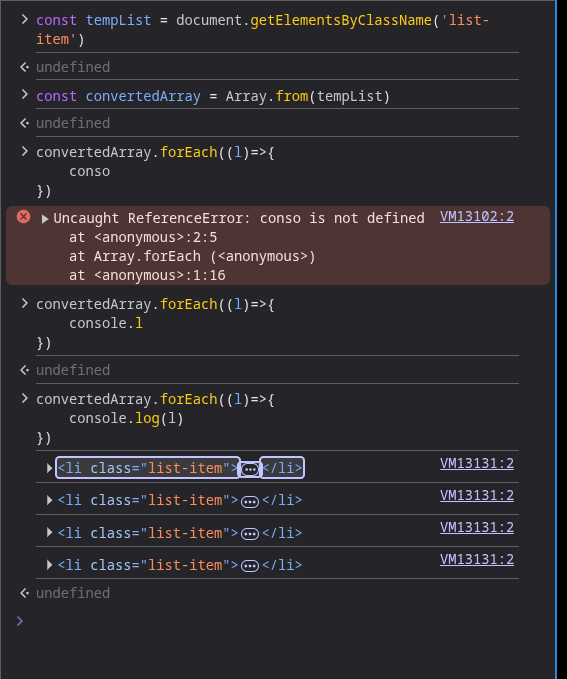

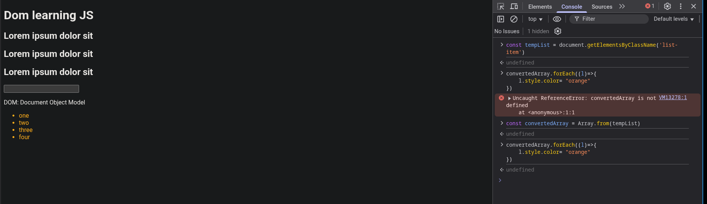

changes in js wiki page using querySelectorAll

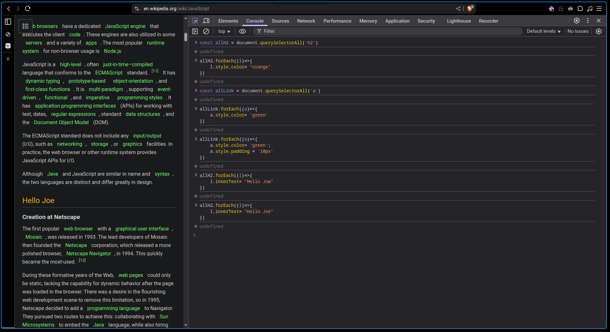