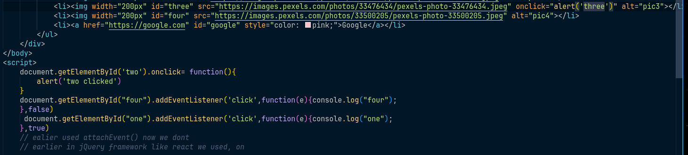

in Js events are ran sequentially, but there are some exceptions

this here <br>
            ```<li></li>```

using onclick like this is not a good approach as not feasible when scaling, dont inject on html code like this. But in case of react its possible as there are libraries to support this

``` document.getElementById('two').onclick= function(){
        alert('two clicked')
    }```
this is second method, this is a better method but does not provide with a lot of features.

third and best approach 
```
 document.getElementById("four").addEventListener('click',function(e){console.log(e);
    },false)
```
Events to learn:
type
timestamp
defaultPrevented (changing default behaviour of any tag)
target
toElement
srcElement
currentTarget
clientX, clientY, screenX, screenY
altkey, ctrlkey, shiftkey, keyCode

Event propagation:
    in code like this:  
```
 document.getElementById("four").addEventListener('click',function(e){console.log(e);
    },false)
```
Refer to the following diagram for event propagation:



True and false in the addEventListener method indicates whether to use capturing or bubbling phase of event propagation.
where true indicates capturing and false indicates bubbling.

Event bubbling: 
    when an event is triggered on an element, it first runs the handlers on it, then on its parent, then all the way up on other ancestors. This is called bubbling. 
    In the above example, if you click on the image with id "four", the click event will first be handled by the image itself, then by its parent <li>, and finally by the <ul>.    

Event capturing:
    In capturing, the event is first captured by the outermost element and propagated to the inner elements. 
    In the above example, if you click on the image with id "four", the click event will first be handled by the <ul>, then by its child <li>, and finally by the image itself. 
