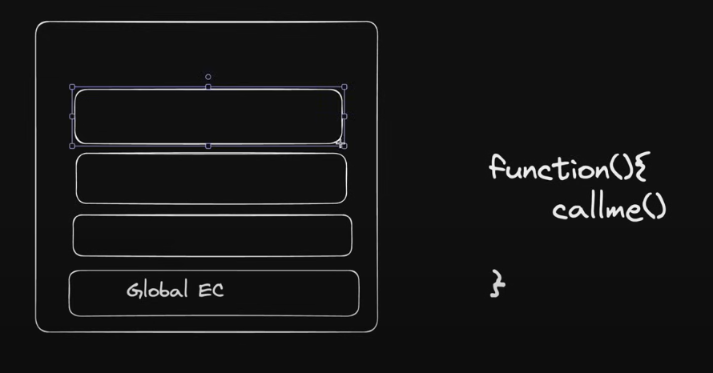
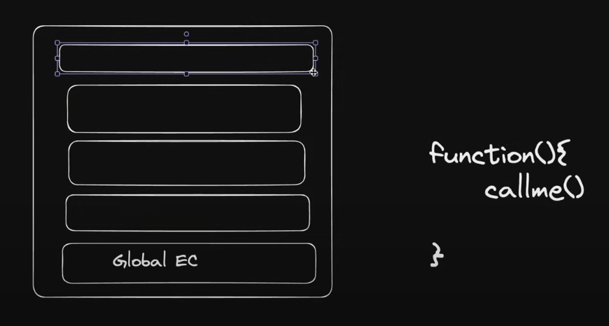

For Call.js(/10_classes_and_oop/Call.js):

Example we have;
```
function(){
    callme();
}
```
for function call the execution context is created and pushed to the call stack.


When callme() is called another execution context is created and pushed to the call stack.


Here callme() needs the context for this function, so it looks for it in the call stack.

so this point to the window object when in browser.
and nodejs it points to an empty object.