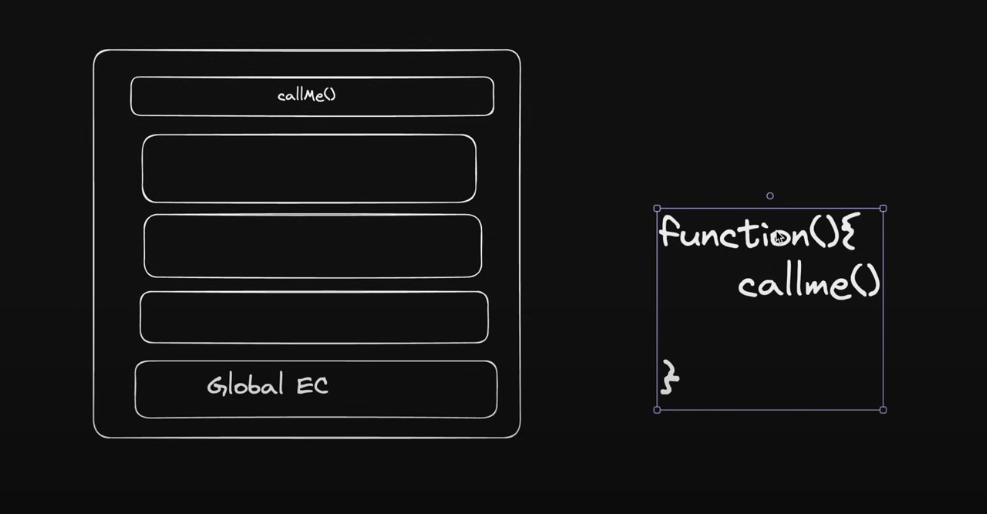

For Call.js(/10_classes_and_oop/Call.js):

Example we have;
```
function(){
    callme();
}
```
when we talk about context, 

ex

function(){
    callme();
}

so here  
funciton is calling callme, so the context of callme is function but its not refereing to the function itself, 
so in this case the 'this' refers to the global execution context, and it when it has access to window then 'this' access to window object.
but when the enviornment is node js, the 'this' will refer to an empty object because node js does not have window object.

[`call.js`](./call.js) for more info

Short notes on bind and call

call()
What it does: Executes a function immediately, setting its this context and passing arguments one by one.

Syntax: function.call(thisArg, arg1, arg2, ...)

Key Feature: Immediate execution (Runs the function right away).

bind()
What it does: Creates and returns a new function that, when executed, has its this context permanently bound to a specified value. Arguments can be partially applied (curried) at the time of binding.

Syntax: function.bind(thisArg, arg1, arg2, ...)

Key Feature: Returns a new function (Does not execute immediately).

Analogy
Method	Analogy
call()	Calling a friend on the phone right now to give them instructions.
bind()	Writing a set of instructions on a sticky note for a friend to use later, with a fixed subject (the this context).

Both methods are primarily used to manage the value of the this keyword inside a function.

so in summary
- call() is for immediate function execution with a specified this context.
- bind() is for creating a new function with a permanently bound this context for later use.