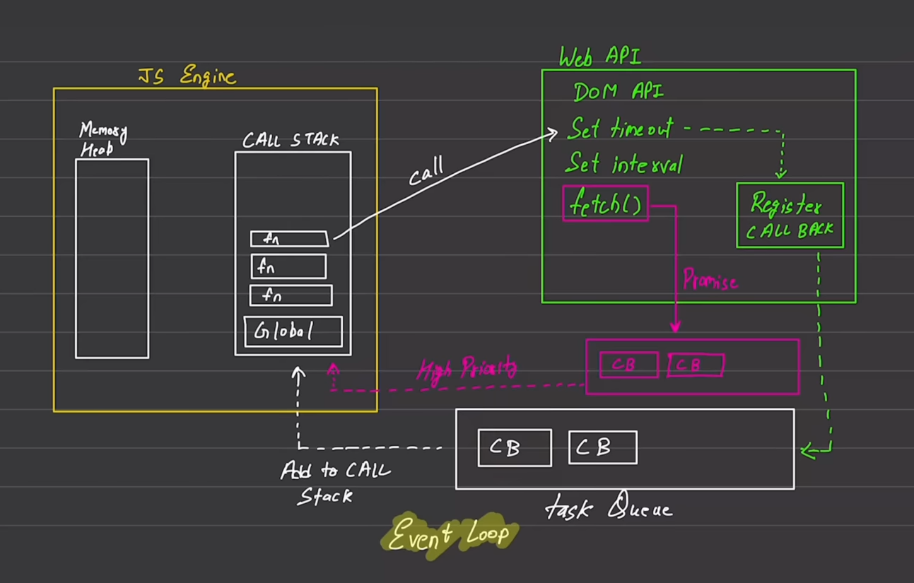
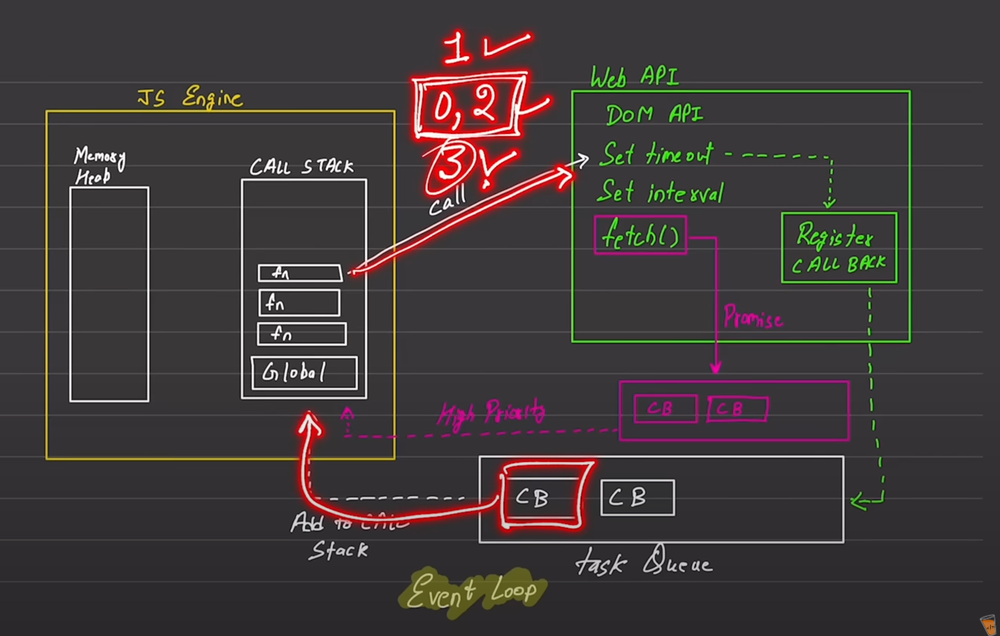

default JS-
1. Synchronous (generally slow compared due to blocking)
2. Single-threaded (one command at a time)

Globale Excetion context:
    executes one command at a time
1. Call stack
2. Heap (memory)

Blocking vs Non-blocking (this is what sets async apart from sync)

1. Blocking code: waits for a task to complete before moving on to the next one. Blocking the flow of program execution.
    ex. read file sync

2. Non-blocking code: can move on to the next task before the previous one finishes, don't block the flow of program execution.
    ex. read file async 

example when setTimeout is 0ms

here first the 1 will execute, then 3 will be executed, as 2 will go as a callback to the callback queue and will be executed only when the call stack is empty.